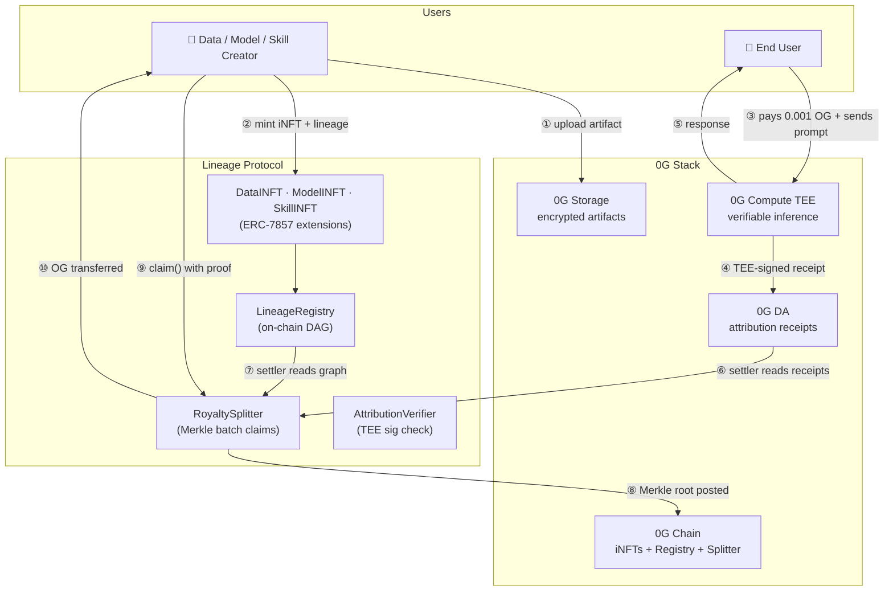
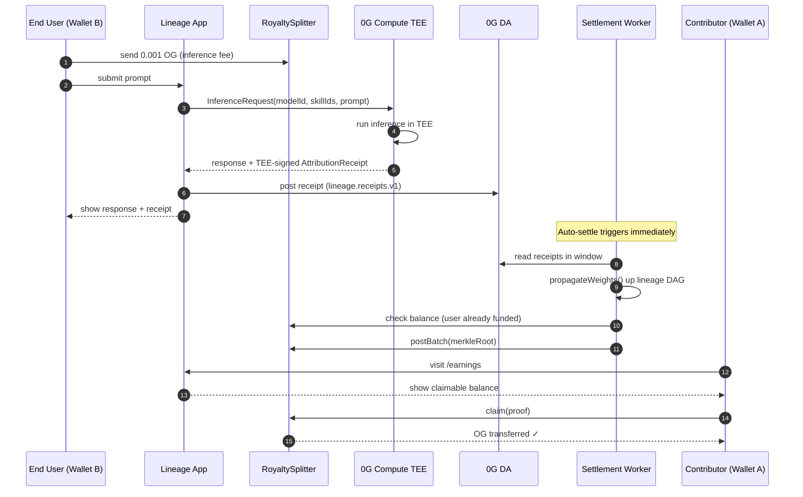
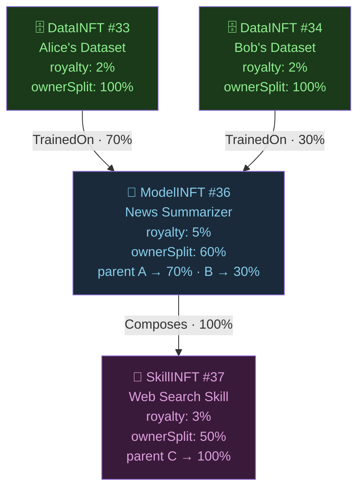

# Lineage — Provenance & Royalty Protocol for AI Agents

> **AI agents run on uncredited work. Lineage fixes that.**
> Every dataset, model, and skill powering an AI agent is an on-chain iNFT. Every inference produces a TEE-signed attribution receipt on 0G DA. Royalties flow automatically to every contributor in the lineage graph — verifiable, trustless, real.

<div align="center">

[](https://lineage-app-sand.vercel.app/demo)
[](https://lineage-5.gitbook.io/lineage/)
[](https://explorer.0g.ai)
[](https://www.hackquest.io/hackathons/0G-APAC-Hackathon)

**[🚀 Try the Live Demo](https://lineage-app-sand.vercel.app/demo) · [📖 Full Docs](https://lineage-5.gitbook.io/lineage/) · [🐦 X / Twitter](https://x.com/lineage_0g)**

</div>

---

## The Problem

AI agents in 2026 are built on top of hundreds of datasets, fine-tuned models, and tools created by contributors who receive nothing when their work is used. There is no audit trail. No royalty mechanism. No way to prove what an agent consumed before making a decision.

**Poseidon raised $15M to attack this.** The EU AI Act mandates attribution. The market has named the problem. Nobody has solved it at the protocol layer — until now.

---

## What We Built

Lineage is a **protocol**, not a product. It is the missing royalty and provenance layer that any AI agent platform on 0G can integrate. Four components:

| Component | What it does |
|---|---|
| **iNFT Graph** | Three token types (`DataINFT`, `ModelINFT`, `SkillINFT`) extending ERC-7857. Each iNFT records its upstream lineage at mint time — an immutable DAG enforced on-chain. |
| **Attribution Receipts** | Every inference through 0G Compute produces a TEE-signed receipt listing every iNFT consumed and its weight. Posted to 0G DA. |
| **Merkle Settlement** | A settler reads receipts, walks the lineage DAG, and distributes royalties to every contributor. Pull-based, gas-efficient, trustless. |
| **Claim UI** | Contributors see their pending balance and claim with one transaction. Real OG, real on-chain settlement. |

---

## 0G Stack — Full Integration

| 0G Primitive | How Lineage Uses It |
|---|---|
| **0G Chain (EVM)** | All 6 contracts: `LineageRegistry`, `DataINFT`, `ModelINFT`, `SkillINFT`, `RoyaltySplitter`, `AttributionVerifier` |
| **0G Storage** | Encrypted artifact blobs — model weights, datasets, skill definitions. iNFTs store only the `storageRoot` content hash on-chain. |
| **0G DA** | Per-inference attribution receipts. Cheap, ordered, publicly verifiable. The settler reads from DA to compute payouts. |
| **0G Compute (TEE)** | Real `qwen-2.5-7b-instruct` inference. The TEE signs every receipt — this is the trust root. Unsigned receipts are rejected at settlement. |
| **ERC-7857 (Agentic ID)** | All three iNFT types extend ERC-7857. Lineage adds a graph layer on top — upstream lineage, royalty policy, and propagation weights. |

---

## Architecture

### System Overview



### End-to-End Money Flow



### Lineage Graph & Attribution Math



**For one inference using Skill #37 with revenue = 0.001 OG:**

| Contributor | Calculation | Payout |
|---|---|---|
| Skill owner | 50% of 3% of 0.001 | 0.000015 OG |
| Model owner | (50%↑ from skill) × 60% × 5% | 0.000009 OG |
| Alice (data) | (40%↑ from model) × 70% × 2% | 0.0000024 OG |
| Bob (data) | (40%↑ from model) × 30% × 2% | 0.0000010 OG |

Every penny traceable. Every contributor paid. Automatically.

---

## Live Demo — Try It Now

**[lineage-app-sand.vercel.app/demo](https://lineage-app-sand.vercel.app/demo)**

Network: **0G Mainnet (chainId 16661)** or **0G Galileo Testnet (chainId 16602)** — switch via the network selector in the app. Testnet OG: [faucet.0g.ai](https://faucet.0g.ai)

### The 3-Minute Flow

1. **Mint** → Go to `/mint`, upload any file, declare lineage parents, set royalty %. Your iNFT is now an on-chain contributor.
2. **Infer** → Go to `/demo`, pick a model/skill, type a prompt. Your wallet sends **0.001 OG** as the inference fee. Approve.
3. **Watch** → Inference runs on 0G Compute. TEE-signed receipt lands on 0G DA. Settlement auto-triggers. Payouts appear.
4. **Claim** → Go to `/earnings`. See your pending balance. Click Claim. OG lands in your wallet.

---

## Traction

| Metric | Value |
|---|---|
| Contracts deployed on 0G Mainnet | 6 |
| Contracts deployed on 0G Galileo Testnet | 6 |
| iNFTs minted | 5+ (3 Data, 1 Model, 1 Skill + user mints) |
| Real inferences run on 0G Compute | Multiple (live TEE-signed) |
| OG claimed on-chain to date | **0.000027 OG** (real settlement, verifiable on explorer) |
| Full stack used | 0G Chain + Storage + DA + Compute + ERC-7857 |
| Build time | 10 days |

> The 0.000027 OG claim is verifiable on the 0G Galileo explorer against `RoyaltySplitter: 0x4F27E90880E6b28525d7f7Eb8785273F11b0D0DE`. This is real money flowing from an end user's wallet to a contributor's wallet as royalty for an AI inference.

---

## Deployed Contracts

The live demo supports both networks — switch between them via the network selector in the app.

### 0G Mainnet (chainId 16661) ✅ Live

| Contract | Address |
|---|---|
| `LineageRegistry` | [`0x7A6cce656a00aD3e763337d8F944F9DB350261C7`](https://explorer.0g.ai/address/0x7A6cce656a00aD3e763337d8F944F9DB350261C7) |
| `DataINFT` | [`0x59DA753Ba0209717f992e7a16f9f9488CfE7ECD2`](https://explorer.0g.ai/address/0x59DA753Ba0209717f992e7a16f9f9488CfE7ECD2) |
| `ModelINFT` | [`0xc7CfEEb82aAb351359B8AaD5c5522b346567Ee79`](https://explorer.0g.ai/address/0xc7CfEEb82aAb351359B8AaD5c5522b346567Ee79) |
| `SkillINFT` | [`0x9Ad28591ab82Ca78F0DecB0E6F532a23B8B72B3A`](https://explorer.0g.ai/address/0x9Ad28591ab82Ca78F0DecB0E6F532a23B8B72B3A) |
| `RoyaltySplitter` | [`0x690835584988f2bF28a3e819965FD9dD18D9A8DB`](https://explorer.0g.ai/address/0x690835584988f2bF28a3e819965FD9dD18D9A8DB) |
| `AttributionVerifier` | [`0x2F3137CE12d67207d81267ed9d404094c50D14C2`](https://explorer.0g.ai/address/0x2F3137CE12d67207d81267ed9d404094c50D14C2) |

**Network config:**

```
Network Name: 0G Mainnet
Chain ID: 16661
RPC URL: https://evmrpc.0g.ai
Storage URL: https://indexer-storage-turbo.0g.ai
Explorer: https://explorer.0g.ai
```

### 0G Galileo Testnet (chainId 16602) — Also supported

| Contract | Address |
|---|---|
| `LineageRegistry` | [`0x5Ba9010bf4A6E13F098d1ce5DBAF52c22E21B3f5`](https://explorer-testnet.0g.ai/address/0x5Ba9010bf4A6E13F098d1ce5DBAF52c22E21B3f5) |
| `DataINFT` | [`0x7986F719737Cbd377Aa436092a0614bda988F18D`](https://explorer-testnet.0g.ai/address/0x7986F719737Cbd377Aa436092a0614bda988F18D) |
| `ModelINFT` | [`0xb54bcd09aAEfF92369D3f722dC8CBfdD6f861892`](https://explorer-testnet.0g.ai/address/0xb54bcd09aAEfF92369D3f722dC8CBfdD6f861892) |
| `SkillINFT` | [`0x90135721Bd43e07955CA1AA5DeD4516CDAf46bcB`](https://explorer-testnet.0g.ai/address/0x90135721Bd43e07955CA1AA5DeD4516CDAf46bcB) |
| `RoyaltySplitter` | [`0x4F27E90880E6b28525d7f7Eb8785273F11b0D0DE`](https://explorer-testnet.0g.ai/address/0x4F27E90880E6b28525d7f7Eb8785273F11b0D0DE) |
| `AttributionVerifier` | [`0x74A7D64b84F3D36494f0Abf7641Dd79E9dfb986E`](https://explorer-testnet.0g.ai/address/0x74A7D64b84F3D36494f0Abf7641Dd79E9dfb986E) |

**Network config:**

```
Network Name: 0G Galileo Testnet
Chain ID: 16602
RPC URL: https://evmrpc-testnet.0g.ai
Explorer: https://explorer-testnet.0g.ai
Faucet: https://faucet.0g.ai
```

---

## Repository Structure

```
lineage/
├── contracts/              # Solidity (Foundry) — 6 contracts
│   └── src/
│       ├── LineageRegistry.sol       # DAG registry, acyclic enforcement
│       ├── DataINFT.sol              # ERC-7857 data token
│       ├── ModelINFT.sol             # ERC-7857 model token
│       ├── SkillINFT.sol             # ERC-7857 skill token
│       ├── RoyaltySplitter.sol       # Merkle batch settlement
│       └── AttributionVerifier.sol   # TEE signature verification
│
├── packages/
│   ├── sdk/                # @lineage/sdk — TypeScript client
│   ├── shared/             # Shared types (AttributionReceipt, etc.)
│   └── crypto/             # libsodium encryption helpers
│
├── services/
│   ├── runner/             # Agent runner — calls 0G Compute, posts receipts
│   └── settler/            # Settlement worker — reads DA, builds Merkle tree
│
├── app/                    # Next.js 16 frontend (Vercel-deployed)
│   ├── app/(app)/mint/     # iNFT mint screen
│   ├── app/(app)/demo/     # Inference + live royalty demo
│   ├── app/(app)/earnings/ # Claim screen
│   └── app/api/            # Server routes: /inference, /settle, /proofs
│
└── scripts/
    ├── deploy-testnet.ts   # Contract deployment
    ├── seed-testnet.ts     # Mint demo iNFTs
    └── register-operator.ts
```

---

## Setup & Run Locally

### Prerequisites

- Node.js 20+
- pnpm 9+
- Foundry (`curl -L https://foundry.paradigm.xyz | bash && foundryup`)
- A wallet funded with testnet OG ([faucet.0g.ai](https://faucet.0g.ai))

### 1. Clone and install

```bash
git clone https://github.com/jatinsahijwani/lineage.git
cd lineage
pnpm install
```

### 2. Configure environment

```bash
# Root .env (for scripts and services)
cp .env.example .env
```

Fill in:

```env
PRIVATE_KEY=0x<your deployer private key>
ZERO_G_RPC_URL=https://evmrpc-testnet.0g.ai
OPERATOR_PRIVATE_KEY=0x<operator wallet key>
```

```bash
# App .env
cp app/.env.example app/.env
```

Fill in all `NEXT_PUBLIC_*` contract addresses from `deployments.json` (or use the live testnet addresses above).

### 3. Build workspace packages

```bash
pnpm --filter '@lineage/shared' build
pnpm --filter '@lineage/crypto' build
pnpm --filter '@lineage/sdk' build
pnpm --filter '@lineage/runner' build
pnpm --filter '@lineage/settler' build
```

### 4. (Optional) Deploy your own contracts

```bash
# Deploy all 6 contracts to 0G Galileo
pnpm deploy:testnet

# Mint demo iNFTs
pnpm seed:testnet

# Register operator
pnpm register-operator
```

### 5. Run the frontend

```bash
cd app
pnpm dev
```

Open [http://localhost:3000](http://localhost:3000).

### 6. Run the full e2e flow

```bash
pnpm e2e
```

This runs the complete flow: mint → inference → settle → claim against the testnet.

---

## How the Attribution Math Works

Lineage uses **declared weights** (v1). When you mint a ModelINFT, you declare how much credit each parent iNFT should receive. The settler propagates these weights up the DAG using:

```
visit(tokenId, incomingWeight):
  owner receives  incomingWeight × (ownerSplitBps / 10000)
  for each parent:
    visit(parent, incomingWeight × (1 - ownerSplitBps/10000) × (edgeWeightBps/10000))
```

Weights always sum to 1.0. DAG is acyclic by enforcement. Max depth 32.

v2 will replace declared weights with Shapley values computed inside the 0G Compute TEE — making attribution measurable, not just declared.

---

## SDK — Integrate Lineage into Any Agent

```typescript
import { LineageClient } from "@lineage/sdk";

const lineage = new LineageClient({
  rpc: "https://evmrpc-testnet.0g.ai",
  contracts: { registry: "0x5Ba9010...", /* ... */ },
});

// Any agent platform integrates with one function
const result = await lineage.runInference({
  modelTokenId: "36",
  skillTokenIds: ["37"],
  input: "Summarize today's news",
});

// Receipt is TEE-signed, posted to 0G DA, and settled automatically
console.log(result.receipt.teeSignature); // 0x...
```

**Planned middleware integrations:** OpenClaw · ElizaOS · LangChain · CrewAI

---

## Security Model

| Threat | Mitigation |
|---|---|
| Forged receipt (fake attribution) | TEE signature verified by `AttributionVerifier`. No enclave key = rejected. |
| Replay attack (same receipt twice) | `markReceiptUsed()` — receipt IDs tracked, duplicates rejected. |
| Cyclic lineage (drain attack) | DFS cycle check at every `registerINFT()` call. |
| Self-dealing parents | Registry validates all declared parents exist before recording edges. |
| Royalty policy bait-and-switch | 24-hour timelock on `updateRoyaltyPolicy()`. |

**Not audited.** This is a 10-day hackathon build. Do not use for production funds without an independent security audit.


---

## Tech Stack

**Contracts:** Solidity ^0.8.24 · Foundry · OpenZeppelin 5.x · ERC-7857

**Backend:** TypeScript · Node.js 20 · viem · pnpm workspaces · merkletreejs · cbor-x · libsodium-wrappers · zod

**Frontend:** Next.js 16 · wagmi v2 · RainbowKit v2 · shadcn/ui · Tailwind CSS · viem

**0G SDKs:** @0gfoundation/0g-compute-ts-sdk · @0gfoundation/0g-storage-ts-sdk · @0glabs/0g-serving-broker

---

## Why 0G

No other stack provides TEE-attested compute, DA-backed receipts, and content-addressed blob storage in a single integrated environment. Building Lineage on a general-purpose EVM chain would require three separate external systems with incompatible trust models. On 0G, every piece is native.

Lineage is the royalty and provenance layer 0G needs for AIverse, OpenClaw, and every other iNFT platform to have attribution built in.

---

## Links

| Resource | URL |
|---|---|
| Live Demo | https://lineage-app-sand.vercel.app/demo |
| GitHub | https://github.com/jatinsahijwani/lineage |
| GitBook Docs | https://lineage-5.gitbook.io/lineage/ |
| X / Twitter | https://x.com/lineage_0g |
| 0G Explorer (RoyaltySplitter) | https://explorer-testnet.0g.ai/address/0x4F27E90880E6b28525d7f7Eb8785273F11b0D0DE |

---

*Built for the 0G APAC Hackathon · May 2026 · Track 1: Agentic Infrastructure & OpenClaw Lab · MIT License*