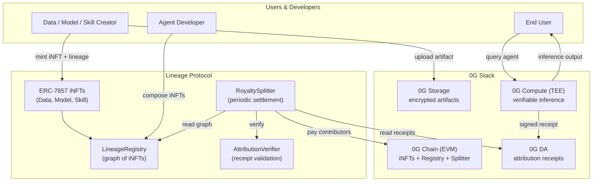

# Lineage

> **The provenance & royalty layer for AI agents on 0G.**
> Every dataset, model, and skill that powers an agent is an iNFT. Every inference produces a signed attribution receipt on 0G DA. Royalties stream automatically to every contributor in the lineage — in real time (batched for gas economics).

**Status:** v0.1 — built for the 0G APAC Hackathon.
**Track:** Track 1 — Agentic Infrastructure & OpenClaw Lab.
**Stack:** 0G Chain · 0G Storage · 0G DA · 0G Compute · ERC-7857.
**License:** MIT (planned).

---

## Table of Contents

1. [The Problem](#1-the-problem)
2. [The Solution in One Page](#2-the-solution-in-one-page)
3. [How Lineage Maps to the 0G Stack](#3-how-lineage-maps-to-the-0g-stack)
4. [Core Concepts](#4-core-concepts)
5. [Architecture by Layer](#5-architecture-by-layer)
6. [End-to-End Flow](#6-end-to-end-flow)
7. [Data Structures & Schemas](#7-data-structures--schemas)
8. [Smart Contract Interfaces](#8-smart-contract-interfaces)
9. [Off-Chain Components](#9-off-chain-components)
10. [SDK / Developer API](#10-sdk--developer-api)
11. [Repository Structure](#11-repository-structure)
12. [Tech Stack & Dependencies](#12-tech-stack--dependencies)
13. [10-Day Build Plan](#13-10-day-build-plan)
14. [v1 Scope & What's Cut](#14-v1-scope--whats-cut)
15. [Security Model & Threat Analysis](#15-security-model--threat-analysis)
16. [Known Limitations & Honest Tradeoffs](#16-known-limitations--honest-tradeoffs)
17. [Demo Script](#17-demo-script)
18. [Submission Package Checklist](#18-submission-package-checklist)
19. [Post-Hackathon Roadmap](#19-post-hackathon-roadmap)
20. [Glossary](#20-glossary)
21. [References](#21-references)

---

## 1. The Problem

AI agents in 2026 sit on top of a stack with **no provenance**. Three concrete pains:

**Contributors don't get paid.** Models are trained on uncompensated data, fine-tuned with uncredited labels, and executed inside agents that compose tools and memories from many authors. Every dollar of agent revenue is built on uncredited work. Poseidon raised $15M from Story to attack this exact problem; the EU AI Act now mandates that AI decisions be "explainable, reviewable, and attributable."

**Agent memory is under attack.** $45M+ was lost in 2026 to memory-poisoning and tool-injection attacks. There's no audit trail for what an agent read before it made a decision.

**iNFTs trade as opaque blobs.** ERC-7857 and AIverse let an agent be tokenized and sold as a single unit. But agents are *composed* — of data, models, skills, and memory. There's no protocol for tracking that composition, so the moment an iNFT is used, attribution evaporates.

These are three faces of the same gap: **AI has no audit trail.** Lineage is the protocol that gives it one.

---

## 2. The Solution in One Page

Lineage is a protocol on 0G with four things in it:

1. **Three iNFT types** (`DataINFT`, `ModelINFT`, `SkillINFT`) that extend ERC-7857. Each iNFT records its **upstream lineage** — the iNFTs it was built from — at mint time.
2. **A LineageRegistry contract** that stores the directed graph of which iNFTs reference which. Cycles are forbidden; insertion is append-only.
3. **An attribution receipt format** — a signed JSON object emitted on every inference, listing every iNFT touched and its weight. Receipts are written to 0G DA (cheap, immutable, verifiable).
4. **A royalty splitter contract** that periodically reads receipts, computes a weighted distribution across the lineage graph, and pays out in `$0G` or USDC.

What it is *not*: a marketplace, an agent framework, or a model training tool. It is the **runtime substrate** that makes AIverse, OpenClaw, ElizaOS, and any other agent-host on 0G able to attribute and pay.

**Why this wins:**
- Uses the full 0G stack (Chain + Storage + DA + Compute + ERC-7857) — almost no other team will.
- Solves a problem 0G has explicitly named in Apollo Accelerator categories ("on-chain data markets") and that Heinrich's three pillars (verified compute, persistent memory, on-chain settlement) make tangible.
- Has a memorable demo moment: live royalty payments visible on screen during inference.
- Has a clear path to grant funding because it's protocol-shaped and adoptable by every existing iNFT host.

---

## 3. How Lineage Maps to the 0G Stack



| 0G Primitive    | What Lineage Uses It For                                                                                                 |
| --------------- | ------------------------------------------------------------------------------------------------------------------------ |
| **0G Chain**    | iNFT contracts, LineageRegistry, RoyaltySplitter, AttributionVerifier. EVM, sub-second finality.                         |
| **0G Storage**  | Datasets, model weights, tool source, memory checkpoints. Encrypted blobs, content-addressed roots.                      |
| **0G DA**       | Per-inference attribution receipts. Cheap, infinitely scalable, verifiable. Settlement reads from here.                  |
| **0G Compute**  | Verifiable inference with TEE-signed receipts. The TEE is the trust root for "this inference really used these iNFTs."   |
| **ERC-7857**    | Underlying NFT standard. Lineage adds the *graph layer* on top — what each iNFT was built from and how royalties flow.   |

---

## 4. Core Concepts

**iNFT.** A token under ERC-7857 representing a unit of intelligence: a dataset, a model, a skill, or a full agent. The token holds an encrypted artifact pointer in 0G Storage and an access policy on-chain.

**Lineage.** The directed acyclic graph (DAG) of iNFTs. A `ModelINFT` has *parents* that are `DataINFT`s; a `SkillINFT` has parents that may be `ModelINFT`s, `DataINFT`s, or other `SkillINFT`s. The graph is enforced by `LineageRegistry`.

**Attribution Receipt.** A canonical signed JSON object emitted by 0G Compute on every inference. Lists the iNFTs touched, the weights, and the inference identity. Posted to 0G DA.

**Attribution Weight.** The fraction of the inference's value attributable to each iNFT. Normalized to sum to 1.0. v1 uses **declared weights** at compose-time (deterministic, simple). v2 introduces a Shapley approximation.

**Royalty Policy.** A per-iNFT setting: percentage of inference revenue claimed by this iNFT (and its lineage), denominated currency, and pause/withdrawal controls.

**Settlement.** The act of computing payouts from a batch of receipts and distributing to contributors. v1 is **batched off-chain accumulation with periodic on-chain Merkle settlement** (gas-efficient). Real-time settlement is v2.

**Lineage Edge.** A typed link in the registry: `(child, parent, weight, edgeType)` where `edgeType ∈ {trained_on, fine_tuned_from, composes, depends_on}`.

**Agent Runner.** The off-chain process that proxies user queries to 0G Compute, builds receipts, posts them to DA, and emits events the splitter consumes. We provide a reference implementation; agent platforms (OpenClaw, ElizaOS) integrate it as a middleware.

---

## 5. Architecture by Layer

Five layers, each independently testable.

### Layer 1 — Identity (iNFTs on 0G Chain)

The on-chain identity of every artifact. Each iNFT is an ERC-7857 token with a `lineageId` field linking to the registry.

**Components:**
- `DataINFT.sol` — a token wrapping a dataset blob in 0G Storage. No parents.
- `ModelINFT.sol` — wraps a model (weights + config). Parents are `DataINFT`s and optionally a base `ModelINFT`.
- `SkillINFT.sol` — wraps a tool, sub-agent, or composed pipeline. Parents are any iNFT.
- `LineageRegistry.sol` — global registry of iNFTs and edges. Source of truth for the graph.

**Invariants:**
- Lineage is acyclic (enforced at edge insertion via a depth-bounded DFS or topological assertion).
- Edges are immutable once recorded.
- Each iNFT can declare exactly one royalty policy at mint time, updatable by owner subject to a timelock (v1: 24-hour timelock).

### Layer 2 — Storage (0G Storage)

All large artifacts live here. Content-addressed; the on-chain iNFT stores only the storage root.

**What's stored encrypted (private metadata under ERC-7857):**
- Model weights (or, for closed weights, a verifiable fingerprint + access proof)
- Memory checkpoints
- Skill source / system prompt
- Tool definitions

**What's stored plaintext (public metadata):**
- Name, description, image
- Lineage graph references (also on-chain in registry)
- Royalty policy summary (also on-chain)

**Why split:** Plaintext metadata is what marketplaces and explorers can render. Encrypted metadata is what the iNFT owner has exclusive access to.

### Layer 3 — Attestation (0G DA)

Every inference produces a receipt. Receipts are too frequent and small to live on-chain directly; DA is exactly the right substrate.

**Receipt sink:** A namespace on 0G DA (`lineage.receipts.v1`) where receipts are posted. Each receipt is content-addressed; the DA root commits to the receipt batch.

**Why DA, not Storage:** receipts must be (a) provable to be available, (b) ordered, and (c) cheap enough to do thousands per agent per day. DA fits this; Storage is overkill and Chain is too expensive.

### Layer 4 — Inference (0G Compute, TEE)

The trust root of attribution. The TEE inside 0G Compute is what *signs* receipts — a receipt without a TEE signature is invalid.

**Inference contract:** the agent runner submits an `InferenceRequest` containing iNFT IDs and inputs; the TEE executes the inference, builds the receipt, signs it with its enclave key, and returns both the response and the receipt.

**Verifier:** `AttributionVerifier.sol` on-chain validates the TEE signature and that the listed iNFTs are real registered iNFTs.

### Layer 5 — Settlement (0G Chain)

Batched, gas-efficient royalty distribution.

**RoyaltySplitter.sol:**
- Maintains accumulators per (iNFT, payer) pair off-chain (in the settlement worker).
- Periodically (configurable: hourly, daily) computes a Merkle root of payouts and posts it on-chain.
- Contributors withdraw via Merkle proof — pulls, not pushes.

**Why pulls, not pushes:** dust avoidance. Pushing $0.0003 to 5 contributors per inference is gas-suicide. Merkle pulls let contributors batch withdrawals across thousands of inferences for the cost of one transaction.

**Real-time path (v2):** for high-value inferences (>$1), an opt-in synchronous splitter that pushes immediately. v1 doesn't ship this.

---

## 6. End-to-End Flow

The full happy path, from data upload to royalty payout.

```mermaid
sequenceDiagram
    autonumber
    participant Alice as Alice (Data Creator)
    participant Bob as Bob (Model Creator)
    participant Carol as Carol (Agent Operator)
    participant Storage as 0G Storage
    participant Registry as LineageRegistry
    participant Compute as 0G Compute (TEE)
    participant DA as 0G DA
    participant Splitter as RoyaltySplitter

    Alice->>Storage: upload encrypted dataset
    Storage-->>Alice: storage root D1
    Alice->>Registry: mint DataINFT(D1, royalty=2%)
    Registry-->>Alice: tokenId d1

    Bob->>Storage: upload model weights
    Storage-->>Bob: storage root M1
    Bob->>Registry: mint ModelINFT(M1, parents=[d1], royalty=5%)
    Registry-->>Registry: assert acyclic; record edges
    Registry-->>Bob: tokenId m1

    Carol->>Registry: register agent (uses m1, skills [s2])
    Note over Carol: Agent runner starts

    User->>Carol: "Summarize today's news"
    Carol->>Compute: InferenceRequest(model=m1, skills=[s2], input=...)
    Compute->>Compute: load m1 weights from Storage; run inference
    Compute-->>Carol: response + signed AttributionReceipt
    Carol->>DA: post receipt
    Carol-->>User: response

    Note over Splitter: Settlement window closes (hourly)
    Splitter->>DA: read all receipts in window
    Splitter->>Registry: load lineage for each iNFT
    Splitter->>Splitter: compute weighted payout per contributor
    Splitter->>Splitter: build Merkle tree; post root on-chain

    Alice->>Splitter: claim() with proof
    Splitter-->>Alice: USDC transferred
    Bob->>Splitter: claim() with proof
    Splitter-->>Bob: USDC transferred
```

---

## 7. Data Structures & Schemas

### 7.1 iNFT On-Chain Struct

```solidity
struct INFTRecord {
    uint256 tokenId;          // ERC-7857 token id
    bytes32 storageRoot;      // 0G Storage content hash
    address owner;            // current owner (also from ERC-721)
    INFTType iType;           // Data | Model | Skill | Agent
    uint16  royaltyBps;       // 0..10000 (basis points)
    address royaltyReceiver;  // contributor payout address
    uint64  createdAt;        // block timestamp
    bool    paused;           // royalty pause flag
}

enum INFTType { Data, Model, Skill, Agent }
```

### 7.2 Lineage Edge

```solidity
struct LineageEdge {
    uint256 child;            // tokenId of derived iNFT
    uint256 parent;           // tokenId of source iNFT
    uint16  weightBps;        // 0..10000, must sum to 10000 across all edges of a child
    EdgeType eType;
}

enum EdgeType { TrainedOn, FineTunedFrom, Composes, DependsOn }
```

### 7.3 Attribution Receipt (off-chain JSON, posted to DA)

```json
{
  "version": "lineage/v1",
  "receiptId": "0x9f4c...e2",
  "agentId": "0x...",
  "agentRunner": "0x...",
  "inferenceId": "uuid-or-hash",
  "timestamp": 1747526400,
  "model": {
    "tokenId": "m1",
    "weight": 0.7
  },
  "skills": [
    { "tokenId": "s2", "weight": 0.2 }
  ],
  "memory": [
    { "tokenId": "mem17", "weight": 0.05 }
  ],
  "data": [
    { "tokenId": "d1", "weight": 0.05 }
  ],
  "inputDigest": "sha256:...",
  "outputDigest": "sha256:...",
  "computeNodeId": "0g-compute-tee-...",
  "teeSignature": "0x..."
}
```

**Notes:**
- Weights MUST sum to 1.0 ± floating-point tolerance.
- The TEE signs the canonical CBOR encoding of this object (deterministic).
- `inputDigest` and `outputDigest` are commitments, not the raw text — privacy-preserving by default.

### 7.4 Royalty Policy

```solidity
struct RoyaltyPolicy {
    uint16  totalRoyaltyBps;     // total cut from inference revenue (e.g., 1000 = 10%)
    address paymentToken;        // address(0) = $0G, else ERC-20
    uint64  pauseUntil;          // 0 = active
    uint16  ownerSplitBps;       // share that goes to current iNFT owner vs. lineage upstream
}
```

`ownerSplitBps` is the critical knob: how much of the royalty stays with this iNFT's owner vs. flows up to its parents. Default at mint: 5000 (50/50). Range: 0 (all to upstream) — 10000 (all to owner, no upstream flow).

### 7.5 Settlement Batch (Merkle root payload)

```solidity
struct SettlementBatch {
    uint256 batchId;
    bytes32 merkleRoot;          // root of [(recipient, token, amount)]
    uint64  windowStart;
    uint64  windowEnd;
    uint256 receiptCount;
    bytes32 daCommitment;        // commits to which DA receipts are in this batch
}
```

---

## 8. Smart Contract Interfaces

Sketches only — full implementations in `contracts/`. Solidity ^0.8.24.

### 8.1 `LineageRegistry.sol`

```solidity
interface ILineageRegistry {
    event INFTRegistered(uint256 indexed tokenId, INFTType iType, bytes32 storageRoot);
    event EdgeRecorded(uint256 indexed child, uint256 indexed parent, uint16 weightBps, EdgeType eType);
    event RoyaltyPolicyUpdated(uint256 indexed tokenId, RoyaltyPolicy policy);

    function registerINFT(
        uint256 tokenId,
        INFTType iType,
        bytes32 storageRoot,
        LineageEdge[] calldata parents,
        RoyaltyPolicy calldata policy
    ) external;

    function getINFT(uint256 tokenId) external view returns (INFTRecord memory);
    function getParents(uint256 tokenId) external view returns (LineageEdge[] memory);
    function getRoyaltyPolicy(uint256 tokenId) external view returns (RoyaltyPolicy memory);
    function isAcyclic(uint256 candidateChild, uint256[] calldata candidateParents)
        external view returns (bool);
}
```

### 8.2 `ERC7857Lineage.sol` (base for Data/Model/Skill)

Extends an ERC-7857 reference implementation. Adds a `mintWithLineage` entry point that calls `LineageRegistry.registerINFT` atomically with the ERC-7857 mint.

```solidity
abstract contract ERC7857Lineage is ERC7857 {
    ILineageRegistry public registry;

    function mintWithLineage(
        address to,
        bytes32 storageRoot,
        bytes calldata encryptedMetadata,
        LineageEdge[] calldata parents,
        RoyaltyPolicy calldata policy
    ) external returns (uint256 tokenId);
}
```

Three concrete contracts inherit this: `DataINFT`, `ModelINFT`, `SkillINFT`. They differ in:
- The `INFTType` they pass.
- Validation of allowed parent types (e.g., `DataINFT` rejects all parents).

### 8.3 `RoyaltySplitter.sol`

```solidity
interface IRoyaltySplitter {
    event BatchPosted(uint256 indexed batchId, bytes32 merkleRoot, uint256 receiptCount);
    event Claimed(address indexed recipient, address token, uint256 amount, uint256 batchId);

    function postBatch(SettlementBatch calldata batch, bytes calldata operatorSig) external;

    function claim(
        uint256 batchId,
        address token,
        uint256 amount,
        bytes32[] calldata proof
    ) external;

    function balanceOf(address recipient, address token) external view returns (uint256);
}
```

**Operator model (v1):** a permissioned settlement operator (the team's worker) posts batches. Operator is publicly known and slashable in v2 via a bond.

### 8.4 `AttributionVerifier.sol`

```solidity
interface IAttributionVerifier {
    function verifyReceipt(
        bytes calldata canonicalReceipt,
        bytes calldata teeSignature,
        address expectedTEE
    ) external view returns (bool);

    function isReceiptUsed(bytes32 receiptId) external view returns (bool);
    function markReceiptUsed(bytes32 receiptId) external;  // only callable by RoyaltySplitter
}
```

---

## 9. Off-Chain Components

### 9.1 Agent Runner (`runner/`)

Node.js / TypeScript service. Sits between the agent host (OpenClaw, ElizaOS, or a custom one) and 0G Compute. Responsibilities:

1. Resolve the agent's iNFT graph: walk parents from the agent's `SkillINFT`/`ModelINFT` to enumerate every iNFT involved.
2. Submit an `InferenceRequest` to 0G Compute with the iNFT IDs and the user input.
3. Receive the response + signed receipt.
4. Verify the receipt locally (TEE signature, weight sum).
5. Post the receipt to 0G DA in the `lineage.receipts.v1` namespace.
6. Cache an inference index for the settlement worker.

### 9.2 Settlement Worker (`settler/`)

Cron-driven (hourly default). Responsibilities:

1. Read all receipts in the window from 0G DA.
2. For each receipt: load each iNFT's lineage from `LineageRegistry`, propagate weights upstream, multiply by royalty policies.
3. Aggregate payouts per (recipient, token).
4. Build a Merkle tree.
5. Call `RoyaltySplitter.postBatch` with the root.
6. Cache proofs by recipient for the claim UI.

### 9.3 Web Frontend (`app/`)

Next.js 14 + wagmi + viem + shadcn/ui. Three primary screens:

- **Mint** — drag-and-drop a dataset/model/skill artifact, declare lineage parents and royalty policy, sign mint tx.
- **Inference Demo** — pick an agent, send a query, watch the receipt appear and royalties flow live.
- **Earnings** — show pending payouts per address, claim button.

---

## 10. SDK / Developer API

`@lineage/sdk` (TypeScript). The integration surface for agent platforms.

```typescript
import { LineageClient, INFTType } from "@lineage/sdk";

const lineage = new LineageClient({
  rpc: "https://rpc.0g.testnet",
  storage: "https://storage.0g.testnet",
  da: "https://da.0g.testnet",
  compute: "https://compute.0g.testnet",
  registry: "0x...",
});

// 1) Mint a Data iNFT
const dataINFT = await lineage.mintData({
  blob: fs.readFileSync("dataset.jsonl"),
  encrypt: true,
  royaltyBps: 200,                // 2%
  ownerSplitBps: 8000,             // 80% to owner, 20% upstream (none here)
});

// 2) Mint a Model iNFT trained on it
const modelINFT = await lineage.mintModel({
  weights: fs.readFileSync("lora.safetensors"),
  encrypt: true,
  parents: [
    { tokenId: dataINFT.tokenId, weightBps: 10000, edgeType: "TrainedOn" },
  ],
  royaltyBps: 500,                // 5%
  ownerSplitBps: 6000,
});

// 3) Run inference with attribution
const result = await lineage.runInference({
  modelTokenId: modelINFT.tokenId,
  skills: [],
  input: "Summarize the news for today.",
});

console.log(result.output);
console.log(result.receipt);     // signed by TEE, posted to DA
```

**Integration points for agent frameworks:**
- `lineage.middleware.openclaw()` — drop-in middleware for OpenClaw.
- `lineage.middleware.eliza()` — drop-in for ElizaOS.
- `lineage.middleware.langchain()` — wraps a LangChain `LLM` to emit receipts.

---

## 11. Repository Structure

```
lineage/
├── README.md                       # this file
├── LICENSE
├── package.json                    # workspaces root
├── pnpm-workspace.yaml
│
├── contracts/                      # Solidity (Foundry)
│   ├── src/
│   │   ├── LineageRegistry.sol
│   │   ├── ERC7857Lineage.sol
│   │   ├── DataINFT.sol
│   │   ├── ModelINFT.sol
│   │   ├── SkillINFT.sol
│   │   ├── RoyaltySplitter.sol
│   │   ├── AttributionVerifier.sol
│   │   └── interfaces/
│   ├── test/
│   ├── script/
│   │   └── Deploy.s.sol
│   ├── foundry.toml
│   └── README.md
│
├── packages/
│   ├── sdk/                        # @lineage/sdk (TS)
│   │   ├── src/
│   │   │   ├── client.ts
│   │   │   ├── mint.ts
│   │   │   ├── inference.ts
│   │   │   ├── receipt.ts
│   │   │   ├── lineage-graph.ts
│   │   │   └── middleware/
│   │   │       ├── openclaw.ts
│   │   │       ├── eliza.ts
│   │   │       └── langchain.ts
│   │   └── package.json
│   ├── shared/                     # types shared across services
│   │   └── src/types.ts
│   └── crypto/                     # encryption helpers (libsodium wrapper)
│       └── src/index.ts
│
├── services/
│   ├── runner/                     # agent runner (TS)
│   │   ├── src/
│   │   │   ├── index.ts
│   │   │   ├── inference.ts
│   │   │   ├── receipt-builder.ts
│   │   │   └── da-poster.ts
│   │   └── Dockerfile
│   └── settler/                    # settlement worker (TS)
│       ├── src/
│       │   ├── index.ts
│       │   ├── window.ts
│       │   ├── attribute.ts
│       │   ├── merkle.ts
│       │   └── poster.ts
│       └── Dockerfile
│
├── app/                            # Next.js 14
│   ├── app/
│   │   ├── mint/page.tsx
│   │   ├── demo/page.tsx
│   │   └── earnings/page.tsx
│   ├── components/
│   ├── lib/
│   ├── tailwind.config.ts
│   └── package.json
│
├── docs/
│   ├── architecture.md
│   ├── attribution-math.md
│   ├── threat-model.md
│   └── images/
│       ├── system-diagram.svg
│       ├── lineage-graph-example.svg
│       └── flow-diagram.svg
│
├── scripts/
│   ├── seed-testnet.ts             # mints example iNFTs for the demo
│   └── e2e-demo.ts                 # full end-to-end flow
│
└── .github/
    └── workflows/
        ├── contracts.yml
        └── ts.yml
```

---

## 12. Tech Stack & Dependencies

### Smart Contracts
- **Solidity** ^0.8.24
- **Foundry** (forge, anvil, cast)
- **OpenZeppelin Contracts** ^5.x (ERC-721 base, AccessControl, MerkleProof)
- **0G Agent NFT reference impl** (eip-7857-draft branch) — vendored or imported as a git submodule

### TypeScript
- **Node.js** 20+
- **pnpm** workspaces
- **viem** + **wagmi** for chain interaction
- **@0glabs/0g-ts-sdk** for Storage / DA / Compute
- **libsodium-wrappers** for symmetric encryption of artifacts
- **CBOR** (cbor-x) for canonical receipt encoding
- **merkletreejs** for settlement Merkle proofs
- **zod** for runtime schema validation

### Frontend
- **Next.js** 14 (App Router)
- **shadcn/ui** + Tailwind
- **wagmi** + **RainbowKit** for wallet
- **Zustand** for local state

### Dev / CI
- **GitHub Actions** for contract & TS tests
- **Vitest** for TS unit tests
- **Playwright** for one e2e smoke test

---

## 13. 10-Day Build Plan

Today: **May 6, 2026.** Submission deadline: **May 16, 2026, 23:59 UTC+8.** I'm budgeting May 15 as the real ship date with May 16 as buffer.

### Day 1 (May 6) — Spec lock & repo skeleton
- [ ] Lock interfaces (this README is the source of truth).
- [ ] `pnpm` workspace skeleton, Foundry init, Next.js init.
- [ ] CI pipelines (contracts + TS) green on empty repos.
- [ ] Testnet wallet funded; RPC, Storage, DA, Compute endpoints verified reachable.

### Day 2 (May 7) — Core contracts (no royalties yet)
- [ ] `LineageRegistry.sol` with acyclic check (depth-bounded DFS, max depth 32).
- [ ] `ERC7857Lineage.sol` base + `DataINFT`, `ModelINFT`, `SkillINFT`.
- [ ] Foundry tests: mint paths, parent-type validation, cycle detection rejection.
- [ ] Deploy to 0G testnet; record addresses in `deployments.json`.

### Day 3 (May 8) — Storage integration
- [ ] `packages/crypto` symmetric encrypt/decrypt utilities (libsodium).
- [ ] SDK `mintData`, `mintModel`, `mintSkill` end-to-end (encrypt → upload to 0G Storage → mint with lineage).
- [ ] CLI script `seed-testnet.ts` mints 3 Data iNFTs, 1 Model iNFT, 1 Skill iNFT for the demo.

### Day 4 (May 9) — Receipt format & DA integration
- [ ] Canonical CBOR encoder/decoder for `AttributionReceipt`.
- [ ] DA poster service.
- [ ] Mock TEE signer for local testing (will be replaced by real 0G Compute on Day 5).
- [ ] SDK `runInference` with mock compute path; receipt posted to DA; e2e test.

### Day 5 (May 10) — Compute integration (the hardest day)
- [ ] Wire actual 0G Compute. Run a small model (Llama-3-8B-instruct or a 0G-hosted model) through Compute.
- [ ] Receive real TEE-signed receipt; verify locally.
- [ ] Buffer half the day for flakiness — 0G Compute will have edge cases.

### Day 6 (May 11) — Royalty splitter & settlement worker
- [ ] `RoyaltySplitter.sol` with Merkle batch posting + claim path.
- [ ] `AttributionVerifier.sol`.
- [ ] `services/settler` reads DA, computes payouts, posts batches.
- [ ] e2e: mint → infer → receipt on DA → batch posted → claim succeeds.

### Day 7 (May 12) — Frontend (mint + demo + earnings screens)
- [ ] Mint screen: drag-drop, lineage picker (autocomplete from registry), royalty sliders.
- [ ] Demo screen: agent dropdown, query input, **live "royalties flowing" panel** (the demo money shot).
- [ ] Earnings screen: pending balances per address, claim button.

### Day 8 (May 13) — Polish & integration with one agent host
- [ ] OpenClaw or ElizaOS middleware (`packages/sdk/src/middleware/openclaw.ts`).
- [ ] One example end-to-end: an OpenClaw agent that uses our middleware, runs through Compute, emits receipts, pays contributors.
- [ ] Full e2e dry run on testnet.

### Day 9 (May 14) — Docs, architecture diagrams, demo video
- [ ] `docs/architecture.md`, `docs/attribution-math.md`, `docs/threat-model.md`.
- [ ] Architecture SVG (export from Mermaid live editor).
- [ ] Demo video: 90 seconds, problem → solution → live demo → vision. Single take + screen recording, voiceover.
- [ ] X launch post draft.

### Day 10 (May 15) — Final dry run & submission
- [ ] Wipe local state; full run from scratch on a fresh wallet.
- [ ] Fix anything broken.
- [ ] Submit to HackQuest. Post on X. Tag `@0G_labs` and `@HackQuest_`.

### May 16 — Buffer
Reserved for whatever broke at the last second. Do **not** plan any new work for this day.

---

## 14. v1 Scope & What's Cut

**In v1 (must ship for submission):**
- DataINFT, ModelINFT, SkillINFT contracts.
- LineageRegistry with acyclic enforcement.
- RoyaltySplitter with Merkle batch settlement.
- AttributionVerifier with TEE signature check.
- SDK: mint, inference, claim.
- Settlement worker (off-chain).
- Frontend with three screens.
- One OpenClaw integration as proof of integration story.
- Full e2e demo: data → model → skill → agent → query → receipt → payout.

**Cut from v1 (deferred to v2):**
- Full Shapley-value attribution (use declared weights for v1).
- Real-time / synchronous royalty payouts (use batched Merkle).
- AgentINFT type (the agent itself as iNFT). v1 tracks agents off-chain; v2 makes agent identity an iNFT too.
- ZKP oracle path. v1 is TEE-only.
- Decentralized settlement operator. v1 has a permissioned operator with a public spec for v2's operator-bonding mechanism.
- Cross-chain. 0G only.
- Slashing for misbehaving operators / oracles.
- A Lineage governance token. **Do not invent a token in v1** — judges punish premature tokens.
- Comprehensive ElizaOS, LangChain, CrewAI middlewares. Ship OpenClaw only; mention the others as the next milestone.
- iNFT updates / re-encryption flows. v1 supports mint and read; updates are a v2 feature requiring the full TEE re-encryption dance.

---

## 15. Security Model & Threat Analysis

### 15.1 Trust Assumptions

| Component                | Trust Assumption                                                                   |
| ------------------------ | ---------------------------------------------------------------------------------- |
| 0G Chain                 | Honest majority of validators; standard EVM trust.                                 |
| 0G Storage               | Files are available and not silently mutated. Content addressing protects against undetected mutation. |
| 0G DA                    | Receipts are available and ordered. Standard DA trust.                             |
| 0G Compute (TEE)         | TEE attestation is valid; enclave key has not been extracted.                      |
| Settlement Operator (v1) | Honest. Permissioned and publicly known. v2 introduces bonding + slashing.         |
| ERC-7857 Oracle          | 0G's hosted TEE oracle for re-encryption (only relevant if iNFTs are transferred — v1 minimizes transfers in the demo). |

### 15.2 Threats and Mitigations

| Threat                                                              | Mitigation in v1                                                                                                                             |
| ------------------------------------------------------------------- | -------------------------------------------------------------------------------------------------------------------------------------------- |
| **Forged receipt** (claim revenue without real inference)           | TEE signature verified by `AttributionVerifier`. Unsigned receipts rejected at settlement.                                                   |
| **Replay attack** (same receipt counted twice)                      | `markReceiptUsed` invariant in verifier; receipt IDs tracked.                                                                                |
| **Self-dealing iNFT** (mint a model claiming nonexistent parents)   | Registry validates parents exist and are registered before recording edges.                                                                  |
| **Cyclic lineage** (mutual royalty drain attack)                    | DFS-based cycle detection at edge insertion.                                                                                                 |
| **Sybil contributor** (mint thousands of cheap Data iNFTs)          | v1: no defense. v2: optional staking for inclusion in royalties.                                                                             |
| **Storage eviction** (artifact disappears, iNFT bricked)            | v1: pin to multiple nodes. v2: incentivized retention.                                                                                       |
| **Operator censorship** (settlement worker excludes a contributor)  | Pulled withdrawals only; receipts on DA are public, so contributors can prove omission and (v2) trigger fallback settlement.                 |
| **Royalty policy exploitation** (mint, then update royalty to 100%) | Royalty updates timelocked 24h; clients cache policy at mint time of receipt.                                                                |
| **Front-running mint of derived iNFT**                              | Standard EVM concern; not Lineage-specific. Ship with private mempool guidance for high-value mints.                                         |

### 15.3 Out of Scope for v1

- Formal verification of contracts.
- Audit. Not feasible in 10 days; *must* mention this in the README.
- Operator decentralization.
- Tokenomics.

---

## 16. Known Limitations & Honest Tradeoffs

The README judges read should match the reality of what we ship. Be upfront about these:

1. **Attribution weights in v1 are declared, not derived.** A model owner declares "this model is 70% Data1, 30% Data2" at mint. There's no ground-truth check that this matches the actual training. v2 introduces verifiable training transcripts via 0G Compute training jobs — only contributions whose use is provable get weight.

2. **Real-time royalties are batched.** A user paying $1 for an inference doesn't see contributors paid that same second. The settlement window is hourly by default. Demo will compress this to ~30 seconds for screen-recording purposes.

3. **Operator centralization.** v1 ships with a single permissioned settlement operator (us). The operator could collude with iNFT owners. Mitigated only by pulled withdrawals + receipts being public on DA, so anyone can audit. v2 introduces operator-bonding.

4. **iNFT-host integration is one platform.** OpenClaw only at hackathon. Other frameworks must adopt our SDK to participate.

5. **Closed-weight models.** True provenance requires you to verify a model was built from the data you claim. For closed-weight models (most commercial LLMs), this is impossible without the model owner's cooperation. Lineage punts on this for v1; treats closed weights as opaque iNFTs whose owner is the only direct contributor.

6. **Privacy of inputs and outputs.** The receipt commits to digests, not plaintext. Plaintext stays inside the TEE. We do not currently support a zero-knowledge proof of input/output content; if a downstream auditor wants to verify the inference matched a specific input, they need cooperation from the agent operator.

7. **No formal audit.** This is a 10-day hackathon build. **Do not deploy to mainnet without an audit.**

---

## 17. Demo Script

90 seconds, single take if possible.

> **Open** on the Mint screen.
>
> *"AI runs on uncredited work. We're going to fix that."*
>
> Drag-drop a small dataset (a JSONL of 100 news headlines). Click Mint. Voice-over: *"Alice mints a Data iNFT. 2% royalty."* Show the explorer: token minted, lineage edge from Data → none.
>
> Switch to a pre-loaded Model iNFT (Bob's, already minted from Alice's data). *"Bob trained a model on Alice's data and minted a Model iNFT. The lineage is on-chain."* Show the lineage graph view: Data → Model.
>
> Open the Demo screen. Pick "News Summarizer Agent" (uses Bob's model + a public web-search Skill). Type *"Summarize today's top story."* Click Run.
>
> Receipt animates onto the screen. Then payouts start streaming: small USDC numbers tick up next to Alice, Bob, the Skill author. *"This is real. Receipt on DA, splitter contract on 0G Chain. Every penny traceable."*
>
> Cut to Alice clicking Claim. Wallet shows USDC arriving. *"Lineage. Provenance and royalties for AI. Built on the full 0G stack. Submission for the APAC Hackathon, Track 1."*
>
> End card with repo link, X handle, and HackQuest submission URL.

---

## 18. Submission Package Checklist

Per the 0G APAC Hackathon rules:

- [ ] **Public GitHub repo** with code, README, LICENSE, deployments.
- [ ] **At least one 0G component used** — we use four. Listed explicitly in README §3.
- [ ] **Working testnet deployment.** Addresses in `deployments.json` and below.
- [ ] **Architecture diagram.** Embedded above (Mermaid) and exported to `docs/images/`.
- [ ] **Demo video** (90s) hosted on YouTube/Loom; link in README header.
- [ ] **At least one public X post** announcing the project, tagging `@0G_labs` and `@HackQuest_`. Link submitted to HackQuest.
- [ ] **HackQuest submission form** filled with:
  - Track: Agentic Infrastructure & OpenClaw Lab.
  - Team members.
  - GitHub link.
  - Demo video link.
  - X post link.
  - Deployment addresses.

**Deployment addresses (to be filled before submission):**
```
LineageRegistry:        0x...
DataINFT:               0x...
ModelINFT:              0x...
SkillINFT:              0x...
RoyaltySplitter:        0x...
AttributionVerifier:    0x...
SettlementOperator EOA: 0x...
```

---

## 19. Post-Hackathon Roadmap

The pitch to 0G Apollo / Ecosystem grants after the hackathon hinges on Lineage being protocol-shaped, not product-shaped. Roadmap is built around that.

### Phase 1 — Hackathon ship (May 16, 2026)
v0.1 as described above. Submitted.

### Phase 2 — Public testnet (June 2026)
- Audit kickoff with one of the 0G ecosystem audit firms.
- ElizaOS and LangChain middlewares.
- AgentINFT type — agents themselves as iNFTs with lineage.
- Operator-bonding spec finalized.

### Phase 3 — Mainnet beta (Q3 2026)
- Audit complete.
- Decentralized operator set (3–5 operators).
- Real-time settlement path for inferences > threshold.
- AIverse integration (we expose a "lineage view" widget AIverse can embed on every iNFT page).

### Phase 4 — Standards push (Q4 2026)
- Submit Lineage's attribution receipt format as an EIP / 0G standard.
- Push for inclusion in ERC-7857 v2 as an optional extension.
- Open governance for attribution-math evolution (weights, Shapley, learnable).

### Grant pitch one-liner
> *"Lineage is the missing royalty + provenance layer of the 0G AI stack. We've shipped v0.1 in 10 days with the full stack integration and one agent-host integration. We need $X to audit, decentralize the operator, and ship middlewares for every major agent framework so every iNFT on 0G has provenance and royalties out of the box."*

---

## 20. Glossary

- **Agent runner** — off-chain process that proxies queries to 0G Compute and posts receipts to DA.
- **Attribution receipt** — signed JSON object listing iNFTs touched in an inference, with weights.
- **CID / storage root** — content-addressed identifier of a blob in 0G Storage.
- **DA (Data Availability)** — 0G's high-throughput data layer, used here for receipts.
- **EdgeType** — the kind of relationship between two iNFTs in the lineage graph (TrainedOn / FineTunedFrom / Composes / DependsOn).
- **iNFT** — Intelligent NFT under ERC-7857.
- **Lineage** — the directed acyclic graph of iNFTs.
- **Merkle settlement** — payout method where a Merkle root of (recipient, amount) is posted on-chain, and recipients pull with proofs.
- **Royalty policy** — per-iNFT settings for cut, currency, owner-vs-upstream split.
- **Settlement window** — time period over which receipts are aggregated for a single batch.
- **TEE** — Trusted Execution Environment. The trust root of receipt signing.

---

## 21. References

### 0G primary sources
- [0G Documentation Hub](https://docs.0g.ai/)
- [ERC-7857 Standard — 0G Documentation](https://docs.0g.ai/developer-hub/building-on-0g/inft/erc7857)
- [INFT Integration Guide — 0G Documentation](https://docs.0g.ai/developer-hub/building-on-0g/inft/integration)
- [0G Introducing ERC-7857](https://0g.ai/blog/0g-introducing-erc-7857)
- [Introducing AIverse](https://0g.ai/blog/introducing-aiverse)
- [0G $88.88M Ecosystem Program](https://0g.ai/blog/0g-ecosystem-program)
- [0G Apollo Accelerator](https://apollo.0g.ai/)

### Standards & specs
- [EIP-7857: AI Agents NFT with Private Metadata](https://eips.ethereum.org/EIPS/eip-7857)
- [ERC-7857 reference implementation (0G Agent NFT, eip-7857-draft branch)](https://github.com/0glabs)

### Hackathon
- [0G APAC Hackathon — HackQuest](https://www.hackquest.io/hackathons/0G-APAC-Hackathon)

### Problem-validation reading
- [Fix AI's data theft problem with onchain attribution — Cointelegraph](https://cointelegraph.com/news/ai-data-theft-onchain)
- [Story-backed Poseidon raises $15M to build AI's data layer — Blockworks](https://blockworks.com/news/poseidon-raises-15m-ais-data-layer)
- [AI Trading Agent Vulnerability 2026 — KuCoin](https://www.kucoin.com/blog/en-ai-trading-agent-vulnerability-2026-how-a-45m-crypto-security-breach-exposed-protocol-risks)

### Community tutorials
- [Deploy your INFT AI Agent to 0G Chain — Mioku/Sergio (Medium)](https://medium.com/@intriiga/deploy-your-inft-ai-agent-to-0g-chain-on-the-new-erc-7857-standard-and-upload-it-to-0g-storage-and-176a482f12d2)
- [ERC-7857 Explained — NFT News Today](https://nftnewstoday.com/2025/05/27/erc-7857-explained-your-guide-to-creating-owning-and-evolving-intelligent-nfts)
- [Agentic NFT Standard (ERC-7857) — Kwame Bryan](https://medium.com/@kwame.bryan/agentic-nft-standard-erc7857-a-blockchain-agnostic-era-awaits-cb48d1a03a95)

---

*Built for the 0G APAC Hackathon · May 2026 · Track 1: Agentic Infrastructure & OpenClaw Lab.*
